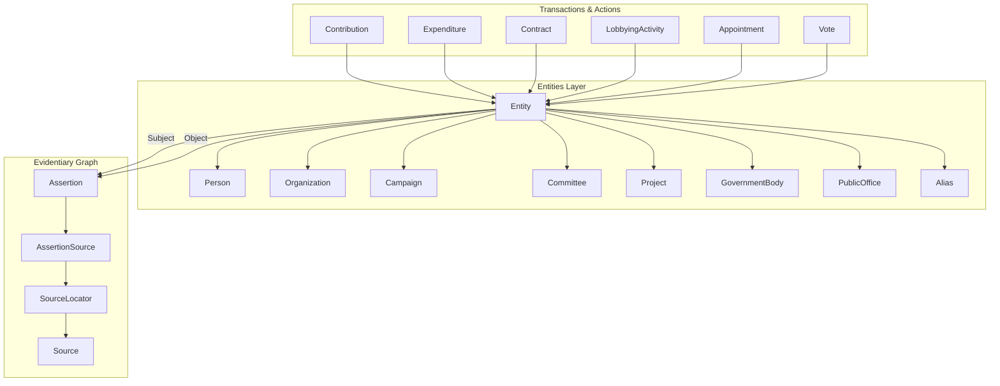

# Sonoma County Political Relationship & Influence Database: Full Tech Map & Walkthrough

This document serves as the complete technical blueprint, architecture guide, and implementation narrative for the expanded Sonoma County Political Relationship & Influence Database. It describes how the application was transformed from a simple campaign finance catalog into a multi-dimensional, evidence-centered civic-research platform.

---

## 1. Architectural Philosophy & Principles

The database is built on three core pillars:
1. **Evidence-Centered Ingestion**: Automatic parsing and matching should populate the database immediately. Human review improves and verifies records but does not act as a blocking gate preventing them from entering the central database.
2. **Dedicated Relational Models**: Transactions, contracts, appointments, and votes reside in dedicated tables rather than generic blobs.
3. **Provable Assertion Provenance**: Every claim or relationship edge must link to one or more specific `SourceLocator` coordinates (document, page number, and text bounding box).

---

## 2. Core Technical Architecture & Taxonomy

The domain structure is organized across three database layers:



### Entity Types (`EntityType`)
- `PERSON`: Human actors (candidates, lobbyists, consultants).
- `ORGANIZATION`: Legal entities (firms, advocacy groups).
- `CAMPAIGN`: Candidates' election campaigns.
- `COMMITTEE`: FPPC-registered campaign committees.
- `DEVELOPMENT_PROJECT`: Real estate planning applications.
- `GOVERNMENT_BODY`: Legislative or advisory boards.
- `PUBLIC_OFFICE`: Official seats (e.g., County Supervisor).
- `BALLOT_MEASURE`: Local measures.
- `PROPERTY_OR_SITE`: Real property.
- `CONTRACT`: Government purchasing contracts.
- `EVENT`: Hearings, public forums.
- `OTHER`: Fallback classification.

---

## 3. Component Map & Models

### A. Entities (`apps/entities/models.py`)
- **`Entity`**: The central canonical node. Has `public_id`, `canonical_name`, `status`, and `publication_status`.
- **`Person`**: Linked OneToOne to `Entity`. Holds first, middle, last name, suffix, display name, public role, and occupation.
- **`Organization`**: Linked OneToOne to `Entity`. Holds category, legal name, and FPPC committee ID.
- **`Alias`**: Alternative names linked to a canonical `Entity`.
- **`EntityMerge`**: Tracks transactionally merged duplicate entities.

### B. Evidentiary Assertions (`apps/assertions/models.py`)
- **`PredicateVocabulary`**: Enforces rules for relationship edges.
  - `code`: Semantic code (e.g. `CONTROLLED_BY`, `CONSULTED_FOR`).
  - `direction`: `DIRECTED` or `SYMMETRIC`.
  - `inverse_predicate`: Reverses the relationship direction.
  - `sensitive_claim`: Flags sensitive associations.
- **`Assertion`**: A statement that Subject Entity is connected to Object Entity/Value via a Predicate.
- **`AssertionSource`**: Maps an `Assertion` to a `Source` via a `SourceLocator`. Stores `source_quality` and `reviewer_notes`.

### C. Transactions & Activities (`apps/transactions/models.py`)
- **`Contribution`**: Schedule A records linking donors to committees.
- **`Expenditure`**: Schedule E disbursements.
- **`Contract`**: Public procurement agreements linking agencies to vendors.
- **`LobbyingActivity`**: Tracks lobbying firms, clients, targeted agencies, compensation, and matters.
- **`AuditEvent`**: Unifies all administrative reviews and merge actions for auditability.

### D. Government & Boards (`apps/government/models.py`)
- **`Appointment`**: Connects a `Person` to a `GovernmentBody` or board.
- **`Meeting`**: Links date, location, and minutes.
- **`AgendaItem`**: Specific docket item.
- **`Motion`**: Motion texts, mover, seconder, and result.
- **`Vote`**: Records voter actions (AYE, NOE, RECUSE, ABSENT).

---

## 4. Completed Milestones Walkthrough

### Milestone 1: Schema Expansion & Database Migration
- Expanded the entity status fields and created the schema structure for contracts, appointments, votes, and lobbying.
- Run migrations successfully to configure SQLite/PostgreSQL schemas.

### Milestone 2: Evidence Provenance, Importer & Timeline
- Implemented visual coordinate support in `AssertionSource` and `SourceLocator`.
- Built the `import_v5_research_workbook` management command. Successfully migrated 100% of the research database rows from the Excel workbook.
- Created the **Chronological Timeline Service** and upgraded the Entity Profile details page to display contributions, contracts, appointments, and votes.

### Milestone 3: Ingestion Modules & Entity Merging
- Implemented a unified document ingestion router that auto-classifies uploads (Form 460, Minutes, Lobbying).
- Created a parser to extract agenda items, motion movers/seconders, and votes from meeting minutes text.
- Created a parser to extract lobbyist-client targeted lobbying activities.
- Implemented `merge_entities` and `unmerge_entities` to manage entity de-duplication with a reversible audit trail.

---

## 5. Visual Ingestion Flow

```
[Document Upload] 
       │
       ▼
[SHA256 Hashing] ──► [Classify Document Type]
                            │
         ┌──────────────────┼──────────────────┐
         ▼                  ▼                  ▼
   [Form 460 PDF]       [Minutes Text]    [Lobbying PDF]
         │                  │                  │
         ▼                  ▼                  ▼
[Extract Schedule A] [Extract Motions]   [Extract Client]
         │                  │                  │
         └──────────────────┼──────────────────┘
                            ▼
               [Query / Auto-match Entities]
                            │
                            ▼
             [Stage Central Records (Provisional)]
                            │
                            ▼
              [Reviewer Confirms / Merges]
```

---

## 6. How to Run & Verify the Code

### Execute Ingestion Command
To import the consolidated Excel workbook:
```bash
python manage.py import_v5_research_workbook
```

### Run Automated Test Suite
To verify the integrity of the extraction, cataloging, matching, merging, and minutes ingestion pipelines:
```bash
pytest
```

### Run System Diagnostics
```bash
python manage.py check
```
