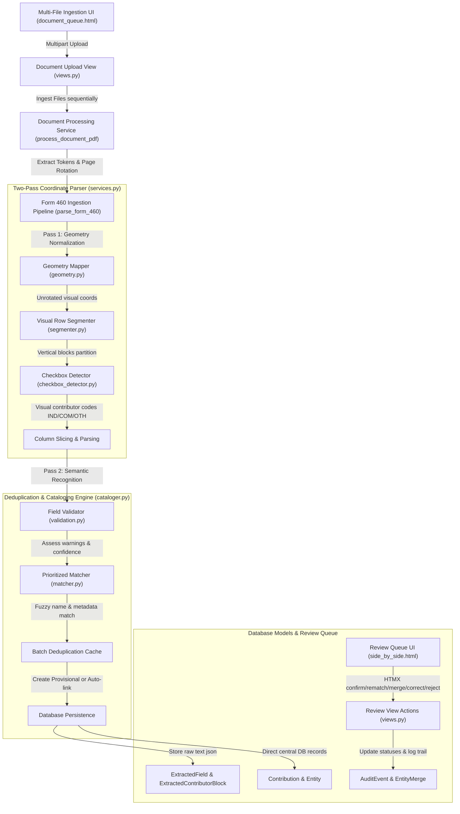

# Technical Blueprint: Ingestion, Matching, and Cataloging Platform

This document serves as an exhaustive reference for developers and LLMs to understand how the California Form 460 Schedule A contributor extraction, prioritized matching, and database cataloging pipeline is structured and operates.

---

## 1. System Architecture Map

The ingestion pipeline transforms PDF documents (digital and scanned) into auditable, status-driven transaction and entity graphs in the central database.

---

## 2. Django Database Schema & Status Model Tier

The platform uses a status-driven model where both provisional machine-extracted data and verified records reside in the **central authoritative database**, differentiated by statuses.

### Entity Statuses (`EntityStatus`):
* `PROVISIONAL_AUTO_CREATED`: Entity profile created automatically during ingestion. Kept internal until reviewed.
* `AUTO_MATCHED`: Entity matched with high confidence, awaiting reviewer confirmation.
* `NEEDS_REVIEW`: Flagged for review due to low match confidence or validation warnings.
* `VERIFIED`: Confirmed by a researcher.
* `MERGED`: Set when a provisional entity is merged into a canonical entity.
* `REJECTED`: Rejected by a reviewer.

### Contribution Statuses (`ReviewStatus`):
* `AUTO_IMPORTED`: Contribution newly imported and linked to a provisional entity.
* `AUTO_MATCHED`: Linked to a canonical entity with high confidence, awaiting review.
* `NEEDS_REVIEW`: Flagged for verification due to possible ambiguities.
* `VERIFIED`: Confirmed and locked by a reviewer.
* `REJECTED`: Excluded from calculations.

### Models Overview:
1. **`Entity` & `Alias`**: The core profile (Person/Organization) and its known alternative names.
2. **`Contribution`**: The transaction ledger entry, linking to `Entity` (donor), `DocumentPage` (provenance), `ExtractedContributorBlock`, and `ImportBatch`.
3. **`ExtractedContributorBlock`**: Stores immutable raw OCR/positioned text, bounding boxes, and parsing details.
4. **`EntityMatchAttempt` & `EntityMatchCandidate`**: Logs the chosen match method, scores (name, location, employer), and competing candidates.
5. **`EntityMerge`**: Preserves merge details (source, target, reason, user) to allow admin-level reversals.
6. **`AuditEvent`**: A comprehensive log trail containing timestamps, actions (`MATCH_CONFIRMED`, `MATCH_OVERRIDDEN`, `ENTITY_MERGED`, `CONTRIBUTION_CORRECTED`), record identifiers, and prior/new JSON values.

---

## 3. Two-Pass Geometric Visual Parser

The extraction pipeline treats pages as a 2D grid:

### Pass 1: Coordinate Normalization
Page coordinates are mapped to a standard rotation-independent visual viewport (width 792pt, height 612pt landscape):
* $vx_0 = page\_height - y_1$
* $vy_0 = x_0$

### Pass 2: Row Segmentation & Column Slicing
* **Row Segmenter (`segmenter.py`)**: Slices the page vertically. Row boundaries are anchored by date-like strings (`MM/DD/YYYY`) in the leftmost column.
* **Column Slicing Proportion Bounds**:
  * Date Column: $vx \in [20, 85]$
  * Name & Address: $vx \in (85, 330]$
  * Checkbox Codes: $vx \in (330, 375]$
  * Occupation & Employer: $vx \in (375, 540]$
  * Amount: $vx \in (540, 630]$
  * Cumulative: $vx \in (630, 792]$
* **Checkbox Detector (`checkbox_detector.py`)**: Locates checkbox ticks in the code column and maps them to `IND`, `COM`, `OTH`, `PTY`, or `SCC` contributor types.

---

## 4. Prioritized Matching & Batch Deduplication (`matcher.py`)

When cataloging an extracted contributor block:
1. **Exact Committee ID Match**: Searches Organizations by FPPC ID. Auto-links.
2. **Exact Normalized Name Match**: case-insensitive alphanumeric equality. Auto-links.
3. **Exact Alias Match**: Matches alternate name profiles. Auto-links.
4. **Name + Location Match**: Matches name plus city/state/zip similarity.
5. **Name + Employment Match**: Matches name plus occupation/employer.
6. **High Fuzzy Match ($\ge 95\%$)**: Auto-links.
7. **Medium Fuzzy Match ($85\% - 94\%$)**: **Only** links if location/employer metadata matches. Otherwise, creates a provisional entity.
8. **Low Match ($< 85\%$)**: Creates a new provisional entity.

### Batch-Level Deduplication Clustering
During a single document parse, a dictionary cache maps `normalized_name + city + occupation`. Multiple identical entries in the same batch cluster to the **same** provisional entity instead of creating duplicates.

---

## 5. Reprocessing Protections

When running the extraction pipeline over a document that was previously parsed:
* We check the database for existing `Contribution` records on that page and block.
* If a contribution's status is `VERIFIED`, `APPROVED`, or `CORRECTED` (meaning a reviewer has approved/modified it), the pipeline **preserves it** intact.
* If the contribution is unreviewed (`AUTO_IMPORTED`, `AUTO_MATCHED`), it is deleted and overwritten with the new parser output.

---

## 6. Review View Actions (`views.py`)

Reviewers execute actions directly on central records:
* **Confirm Match**: Updates status to `VERIFIED` and marks match as `REVIEWER_CONFIRMED`.
* **Rematch / Override**: Links contribution to another canonical entity, updates status to `VERIFIED`, sets match method to `REVIEWER_OVERRIDDEN`, and records the prior/new entity mapping in `AuditEvent`.
* **Merge Entities**: Re-links all transactions of a source provisional entity to a target entity, adds the source name as an `Alias` on the target entity, sets the source status to `MERGED`, and saves the merger in `EntityMerge`.
* **Reverse Merge**: Restores the source entity status, scans merge logs, and re-links the transactions back to the source entity.
* **Reject**: Marks contribution status as `REJECTED`, keeping the raw extraction block immutable.
* **Correct**: Updates transaction values and logs the `prior_value` vs `new_value` in the audit event trail.
