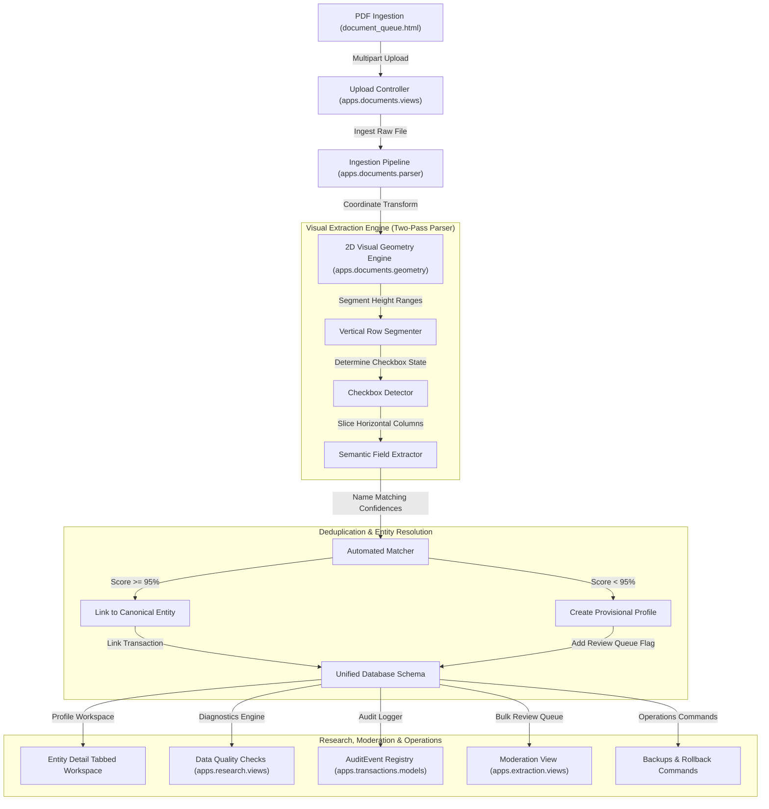

# Technical Architecture Map & Developer Explainer

This document serves as the master blueprint for the Sonoma County Political Relationship & Influence Database platform. It details the structural layout, processing engines, database schemas, operations pipelines, and verification routines to enable future development.

---

## 1. System Architecture Map

The civic-research platform is organized into decoupled Python/Django modules that ingest, extract, moderate, audit, and analyze political finance and influence datasets.



---

## 2. Directory & Module Map

| Module Path | Primary Purpose | Key Files & Components |
| :--- | :--- | :--- |
| `apps/entities/` | Manages canonical profiles, aliases, project files, and merge histories. | `models.py` (Entity, Alias, EntityMerge), `views.py` (entity_list, entity_detail, entity_moderate) |
| `apps/transactions/` | Campaign finance transactions, expenditures, lobbying registries, and audit logs. | `models.py` (Contribution, Expenditure, LobbyingActivity, AuditEvent) |
| `apps/government/` | Boards, appointments, public offices, meeting agendas, and voting records. | `models.py` (PublicOffice, GovernmentBody, Appointment, Meeting, Vote) |
| `apps/documents/` | Ingestion parser, page geometry normalization, and PDF storage. | `models.py` (Document, DocumentPage), `geometry.py`, `parser.py` |
| `apps/extraction/` | Review queue side-by-side workspace and entity deduplication. | `views.py` (review_queue, merge_entities, reverse_entity_merge, moderate_bulk_action) |
| `apps/research/` | Research portfolios, saved search logs, and data quality check dashboards. | `models.py` (SavedSearch, ResearchCollection), `views.py` (data_quality) |
| `apps/audit/` | Tracks workbook and spreadsheet import batches and row histories. | `models.py` (ImportBatch, ImportRow, LegacyIdentifier), `commands/` (database_backup.py, rollback_import.py) |
| `templates/` | Standardized modern aesthetics templates. | `base.html`, `entities/`, `extraction/`, `documents/` |

---

## 3. Core Processing Pipelines

### 3.1. Ingestion PDF Coordinate Transform
NetFile Form 460 Schedule A contributor logs are generated rotated 90 degrees. The geometry utility `geometry.py` normalizes raw PDF points into standard visual coordinates:
$$vx_0 = page\_height - y_1$$
$$vy_0 = x_0$$

Horizontal columns are sliced using normalized proportion bounds:
- **Date Received**: $vx \in [20, 85]$ (Leftmost column anchor)
- **Name & Address**: $vx \in (85, 330]$
- **Contributor Checkboxes**: $vx \in (330, 375]$
- **Occupation & Employer**: $vx \in (375, 540]$
- **Amount Received**: $vx \in (540, 630]$
- **Cumulative & Cycle Codes**: $vx \in (630, 792]$

Row heights are dynamically partitioned by detecting date strings matching `\d{1,2}/\d{1,2}/\d{2,4}` in the Date column, acting as **vertical row anchors**.

### 3.2. Deduplication & Reversible Merge Engine
When merging entity $A$ (source) into entity $B$ (target):
1. **Dynamic Reference Scanning**: The system uses Django's application registry (`django.apps.apps`) to automatically discover all foreign keys pointing to `Entity`.
2. **Trace Registry Logging**: It modifies the references on matching rows to point to target $B$, and saves their primary keys and model names as JSON inside the `reassigned_relations` field on `EntityMerge`:
   ```json
   {
     "transactions.Contribution": { "donor_entity": ["UUID-1", "UUID-2"] },
     "government.Vote": { "voter_person": ["UUID-3"] }
   }
   ```
3. **Flawless Reversals**: Reversing a merge reads the JSON trace registry, reinstates the source entity's status, and restores precisely the modified foreign keys, preventing corruption of other target records.

### 3.3. Database Quality Integrity Checks
The diagnostics checks verify:
- **Orphan Transactions**: Campaign transactions not connected to any canonical or provisional profile.
- **Review Warnings**: Verified assertions that do not contain reviewer metadata.
- **Duplicate Transactions**: Records having matching donor, recipient, date, and amount values.
- **Impossible Timestamps**: Transaction dates set in the future or preceding filing limits.
- **Incomplete Activities**: Lobbying activity logs missing matte details or compensation values.

---

## 4. Database Schema Map (Core Entities)

### 4.1. Entities & Merges (`apps/entities/models.py`)
- **Entity**: Tracks target canonical and provisional names.
  - `status`: `APPROVED`, `VERIFIED`, `PROVISIONAL_AUTO_CREATED`, `DISPUTED`, `REJECTED`, `MERGED`.
  - `publication_status`: `INTERNAL_ONLY`, `NEEDS_REVIEW`, `PUBLISHABLE`, `PUBLISHED`, `WITHHELD`.
- **Alias**: Stores secondary spelling variations linked to the main profile.
- **EntityMerge**: Records merge relationships, trace registries, and reversion status.

### 4.2. Campaign & Lobbying Transactions (`apps/transactions/models.py`)
- **Contribution**: Campaign donation records containing donor, recipient, batch, and page details.
- **Expenditure**: Spending registers holding agent/subcontractor, amendment, and filing attributes.
- **LobbyingActivity**: Registers lobbyist firm, targeted agency, client, matters, and compensation.

### 4.3. Audit & Logging (`apps/transactions/models.py` & `apps/audit/models.py`)
- **AuditEvent**: Log recording database updates, old/new states, actions, and managing user.
- **ImportBatch**: Tracks import logs, batches, filenames, status, and summary counts.
- **ImportRow**: Stores raw JSON rows imported during batches.

---

## 5. Operations & Backups Commands

- **Daily Backups**: Run `python manage.py database_backup`.
  - Executes SQLite `PRAGMA integrity_check` to verify database health.
  - Copies the SQLite database file to `backups/db_backup_YYYYMMDD_HHMMSS.sqlite3`.
  - Prunes the folder to retain only the 5 most recent backups.
- **Rollback Batches**: Run `python manage.py rollback_import <batch_uuid>`.
  - Deletes all transaction records associated with the target batch.
  - Isolates and deletes provisional entities created by that batch *only* if they have no other transactions or assertions referenced.
  - Sets the batch status to `ROLLED_BACK`.

---

## 6. Development & Verification Commands

To run all automated integration and operations tests locally:
```powershell
$env:USE_SQLITE="True"; pytest
```

To run Django system integrity checks:
```powershell
$env:USE_SQLITE="True"; python manage.py check
```
